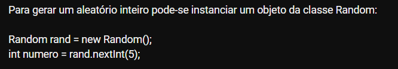

# OPERADORES LOGICOS

 <br>
 <br>
 <br>
 <br>
 <br>
 <br>
 <br>
 <br>
 <br>

Os operadores lógicos em Java são usados para realizar operações de lógica booleana em expressões que envolvem valores booleanos (verdadeiro ou falso). Eles são frequentemente usados em estruturas de controle de fluxo, como condicionais e loops, para tomar decisões com base em condições. Existem três operadores lógicos principais em Java: `&&` (E lógico), `||` (OU lógico) e `!` (NÃO lógico). Vou explicar cada um deles e dar exemplos de uso:

1. **E Lógico (`&&`)**: O operador `&&` realiza uma operação de E lógico em duas expressões booleanas. Retorna verdadeiro apenas se ambas as expressões forem verdadeiras.

   Exemplo:
   ```java
   boolean condicao1 = true;
   boolean condicao2 = false;
   boolean resultado = condicao1 && condicao2; // resultado é falso
   ```

2. **OU Lógico (`||`)**: O operador `||` realiza uma operação de OU lógico em duas expressões booleanas. Retorna verdadeiro se pelo menos uma das expressões for verdadeira.

   Exemplo:
   ```java
   boolean condicao1 = true;
   boolean condicao2 = false;
   boolean resultado = condicao1 || condicao2; // resultado é verdadeiro
   ```

3. **NÃO Lógico (`!`)**: O operador `!` inverte o valor de uma expressão booleana. Se a expressão original for verdadeira, `!` a tornará falsa, e vice-versa.

   Exemplo:
   ```java
   boolean condicao = true;
   boolean resultado = !condicao; // resultado é falso
   ```

Além disso, você pode usar parênteses para criar expressões lógicas complexas e controlar a ordem de avaliação. Por exemplo:

```java
boolean condicao1 = true;
boolean condicao2 = false;
boolean condicao3 = true;

boolean resultado = (condicao1 && condicao2) || (condicao1 && condicao3); // resultado é verdadeiro
```

Os operadores lógicos são amplamente usados em estruturas condicionais, como `if`, `else if` e `while`, para tomar decisões com base em condições. Eles são uma parte fundamental da programação Java e ajudam a controlar o fluxo do programa com base em valores booleanos.