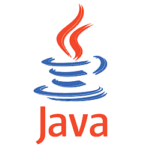

# CURSO DE JAVA
👨‍⚖️JAVA É UMA LINGUAGEM DE PROGRAMAÇÃO.

  

## VISÃO PANORÂMICA:
| PERGUNTA | RESPOSTA |
| :---: | :---: |
| DATA DE CRIAÇÃO | 1991 |
| NOME DO CRIADOR | James Gosling, Mike Sheridan e Patrick Naughton | 
| SIGNIFICADO DO NOME | Acredita-se que o nome "Java" tenha sido inspirado pelo café Java, que é cultivado na Indonésia e era uma bebida popular entre a equipe de desenvolvimento. |
| É BASEADA NO | C C++ |
| EXTENÇÃO DO ARQUIVO | .java |
| É MAIS USADA | Criação de Apps para Android |

* O Java foi criado por James Gosling, Mike Sheridan e Patrick Naughton na Sun Microsystems, que mais tarde foi adquirida pela Oracle Corporation. O desenvolvimento da linguagem começou em 1991 e a primeira versão pública do Java, chamada de Java 1.0, foi lançada em 1996.
* O nome "Java" foi escolhido inicialmente como um substituto temporário para o nome original, "Oak". No entanto, a equipe de desenvolvimento acabou gostando do nome e decidiu mantê-lo. Acredita-se que o nome "Java" tenha sido inspirado pelo café Java, que é cultivado na Indonésia e era uma bebida popular entre a equipe de desenvolvimento.
* O Java é uma linguagem de programação de propósito geral que foi projetada para ser portável, segura e fácil de usar. Uma das principais características do Java é sua capacidade de executar em diferentes plataformas, conhecida como "write once, run anywhere" (escreva uma vez, execute em qualquer lugar). Isso é possível devido à máquina virtual Java (JVM), que permite que os programas Java sejam executados em diferentes sistemas operacionais sem a necessidade de modificação do código-fonte.
* O Java é mais conhecido por seu uso no desenvolvimento de aplicativos empresariais e sistemas distribuídos. É amplamente utilizado para criar aplicativos de desktop, aplicativos móveis para Android, sistemas de gerenciamento de bancos de dados, servidores de aplicativos, sistemas de mensagens, sistemas de comércio eletrônico e muito mais.
* Além disso, o Java também é usado em várias outras áreas, como desenvolvimento de jogos, aplicativos científicos, sistemas embarcados e Internet das Coisas (IoT).
* Em resumo, o Java é uma linguagem de programação amplamente usada, criada por James Gosling e sua equipe na Sun Microsystems. Ele é conhecido por sua portabilidade, segurança e uso em uma variedade de domínios de aplicativos, com destaque para o desenvolvimento de aplicativos empresariais e sistemas distribuídos.

## HISTORIA DO JAVA:
1. **Início da década de 1990**: A equipe da Sun Microsystems, liderada por James Gosling, Patrick Naughton e Mike Sheridan, inicia o projeto Green, com o objetivo de desenvolver uma linguagem de programação para dispositivos eletrônicos de consumo.

2. **1991**: Durante o desenvolvimento do projeto Green, a equipe trabalha em uma linguagem de programação chamada Oak. Mais tarde, por questões legais, o nome é alterado para Java.

3. **1995**: O Java 1.0 é lançado oficialmente pela Sun Microsystems em maio. Este lançamento inclui o Java Development Kit (JDK) 1.0 e o Java Runtime Environment (JRE) 1.0.

4. **1996**: A Sun Microsystems introduz o conceito de "Write Once, Run Anywhere" (WORA), destacando a capacidade do Java de ser executado em qualquer plataforma que tenha uma máquina virtual Java.

5. **1997**: A Sun Microsystems lança o Java 1.1, introduzindo várias melhorias significativas na linguagem, incluindo classes internas, coletor de lixo aprimorado e suporte para o protocolo de comunicação RMI (Remote Method Invocation).

6. **2006**: A Sun Microsystems lança o Java Platform, Standard Edition 6 (Java SE 6), com melhorias no desempenho, suporte a web services e muitas outras atualizações.

7. **2010**: A Oracle Corporation adquire a Sun Microsystems, tornando-se a mantenedora do Java.

8. **2014**: A Oracle lança o Java 8, introduzindo recursos importantes, como expressões lambda, Streams API, e melhorias na API de data e hora.

9. **2017**: O Java SE 9 é lançado, trazendo modificações significativas na forma como o Java é distribuído e implantado, incluindo o módulo do sistema.

10. **2018**: A Oracle lança o Java SE 10, marcando a mudança para um modelo de lançamento de versões mais frequentes, com uma nova versão do Java a cada seis meses.

11. **2022**: Java continua sendo uma das linguagens de programação mais populares e amplamente usadas em todo o mundo, em uma variedade de aplicativos, desde desenvolvimento de aplicativos móveis até desenvolvimento de sistemas empresariais.

## REGRAS DO JAVA:
1. **Importação de Pacotes**: Ao desenvolver em Java, é necessário importar o pacote do diretório onde o arquivo está localizado, garantindo o acesso às classes e recursos necessários para o projeto.

2. **Convenções de Nomenclatura**: Para nomear arquivos, funções, variáveis, classes e métodos em Java, é essencial seguir a convenção conhecida como "Camel Case". Por exemplo, um nome de arquivo deve ser formatado como "NomeDoArquivo.java".

3. **Nomenclatura de Classes Públicas**: Uma classe pública em Java deve ter o mesmo nome do arquivo em que está definida, facilitando a identificação e utilização do código por outros desenvolvedores.

4. **Estrutura de Classes**: Mesmo para tarefas simples, como imprimir "olá mundo" no console, é necessário criar uma classe em conformidade com os princípios da Programação Orientada a Objetos (POO).

5. **Declaração de Variáveis**: Ao declarar variáveis, é obrigatório especificar o tipo de dado que elas armazenarão, como "int", "float" ou "String" (sendo esta última um objeto).

6. **Conversão de Entrada de Dados**: Quando se espera uma entrada numérica do usuário, é necessário realizar a conversão dos dados do tipo String para o tipo numérico apropriado, utilizando métodos como "Integer.parseInt".

7. **Finalização de Comandos**: Em Java, é imprescindível terminar cada instrução com o caractere ";" para indicar o fim do comando.

8. **Geração de Bytecode pela IDE**: As IDEs (Ambientes de Desenvolvimento Integrado) em Java são responsáveis por gerar o bytecode do código fonte, o qual pode ser executado em múltiplas Máquinas Virtuais Java (JVMs), garantindo a portabilidade do código em sistemas como Android, Linux e Windows.

## CARACTERISTICAS:
### POSITIVAS:
* **1 - Simplicidade:** A sintaxe do Java é fácil de ler e entender, o que facilita o desenvolvimento e a manutenção do código. A linguagem foi projetada para ser simples e intuitiva, o que a torna acessível até mesmo para programadores iniciantes.
* **2 - Portabilidade:** Uma das principais vantagens do Java é sua portabilidade. Os programas escritos em Java podem ser executados em diferentes plataformas, como Windows, macOS e Linux, sem a necessidade de alterar o código-fonte. Isso é possível devido à máquina virtual Java (JVM), que interpreta o código Java e o traduz para a linguagem de máquina específica da plataforma em que está sendo executado.
* **3 - Orientação a Objetos:** Java é uma linguagem orientada a objetos, o que significa que ela suporta conceitos fundamentais de programação orientada a objetos, como encapsulamento, herança, polimorfismo e abstração. Essa abordagem promove a modularidade, reutilização de código e facilita a criação de programas bem estruturados e escaláveis.
* **4 - Grande biblioteca padrão:** Java possui uma biblioteca padrão abrangente, conhecida como Java Standard Library (JSL), que fornece uma ampla gama de classes e métodos para realizar tarefas comuns de programação. Essa biblioteca inclui utilitários para manipulação de strings, operações de entrada e saída, processamento de arquivos, networking, entre outros. Isso acelera o desenvolvimento, pois muitas funcionalidades já estão disponíveis e prontas para uso.
* **5 - Comunidade ativa e suporte:** Java possui uma comunidade de desenvolvedores muito ativa e um amplo suporte da Oracle, empresa responsável pelo desenvolvimento e manutenção da linguagem. Isso significa que você pode encontrar uma vasta quantidade de recursos, tutoriais, documentação e fóruns online para obter ajuda e aprender novas técnicas.
* **6 - Segurança:** Java possui recursos de segurança robustos integrados em sua plataforma. A JVM executa o código Java em um ambiente sandbox, que restringe o acesso a recursos do sistema operacional, como o sistema de arquivos e rede. Isso ajuda a evitar a execução de código malicioso e a proteger o computador e os dados.

### NEGATIVAS:
* **1 - Verbosidade:** O Java é conhecido por sua verbosidade, o que significa que é necessário escrever mais linhas de código em comparação com outras linguagens de programação para realizar certas tarefas. Isso pode levar a um código-fonte mais extenso e complexo, tornando o desenvolvimento mais demorado.
* **2 - Curva de Aprendizado:** Java possui uma curva de aprendizado íngreme para iniciantes, especialmente para aqueles que não têm experiência prévia em programação. A sintaxe complexa e a grande quantidade de conceitos de programação orientada a objetos podem tornar o aprendizado inicial do Java um pouco desafiador. 
* **3 - Desempenho Relativo:** Embora o Java tenha um desempenho sólido em muitos casos, algumas pessoas argumentam que ele pode ser um pouco mais lento em comparação com outras linguagens de programação de baixo nível, como C ou C++. Isso ocorre porque o código Java precisa ser executado em uma máquina virtual, adicionando uma camada de abstração entre o código e o sistema operacional.
* **4 - Consumo de Memória:** A execução do código Java requer a alocação de memória para a JVM (Java Virtual Machine), o que pode resultar em um consumo relativamente alto de memória em comparação com algumas outras linguagens. Isso pode ser uma preocupação em ambientes com recursos limitados, como dispositivos embarcados ou sistemas com restrições de memória.
* **5 - Gerenciamento de Memória:** Embora o Java forneça o gerenciamento automático de memória através do coletor de lixo (garbage collector), alguns desenvolvedores argumentam que essa abordagem pode levar a picos de uso de memória e latências imprevisíveis. Em cenários de alto desempenho ou em sistemas que exigem controle preciso sobre a alocação e liberação de memória, a falta de controle direto sobre o gerenciamento de memória pode ser vista como uma desvantagem.

## SUBSIDIOS:
- [CURSO CRIADO PELO "CURSO EM VIDEO":](https://www.youtube.com/@CursoemVideo)
  - [JAVA BÁSICO](https://www.youtube.com/playlist?list=PLHz_AreHm4dkI2ZdjTwZA4mPMxWTfNSpR)
  - [JAVA POO](https://www.youtube.com/playlist?list=PLHz_AreHm4dkqe2aR0tQK74m8SFe-aGsY)
- [CURSO FEITO PELO VILHALVA](https://github.com/VILHALVA)
- [VEJA A DOCUMENTAÇÃO](https://docs.oracle.com/en/java/)
- [VEJA A SINTAXE](./SINTAXE.md)
- [CURSO DE JAVA POO](https://github.com/VILHALVA/CURSO-DE-JAVA-POO)
